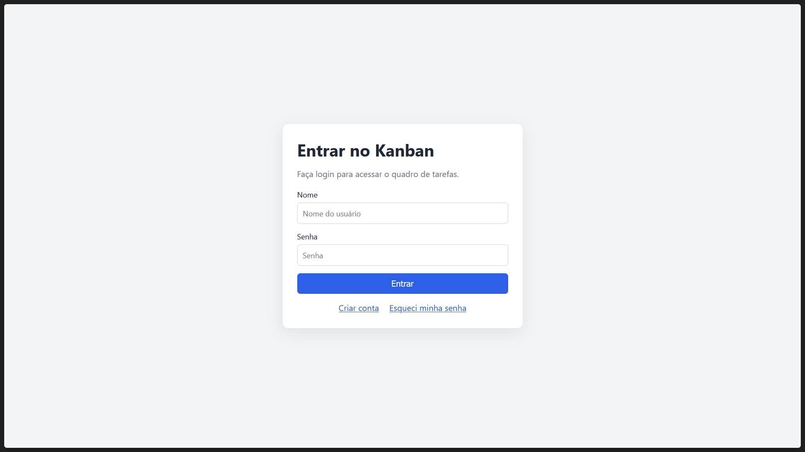
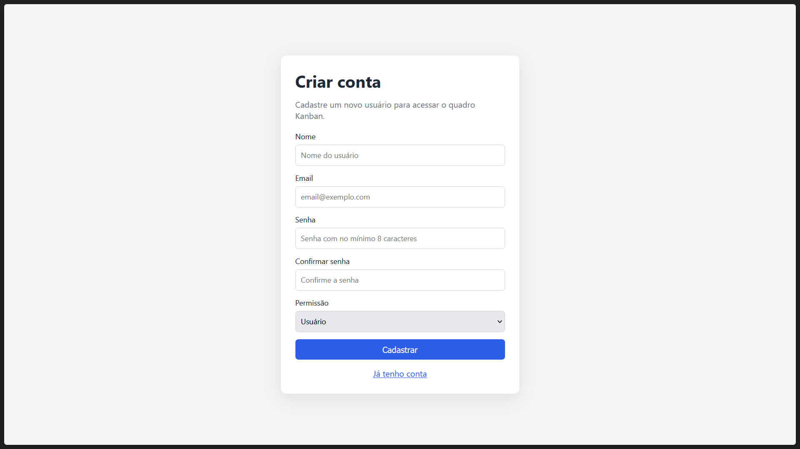
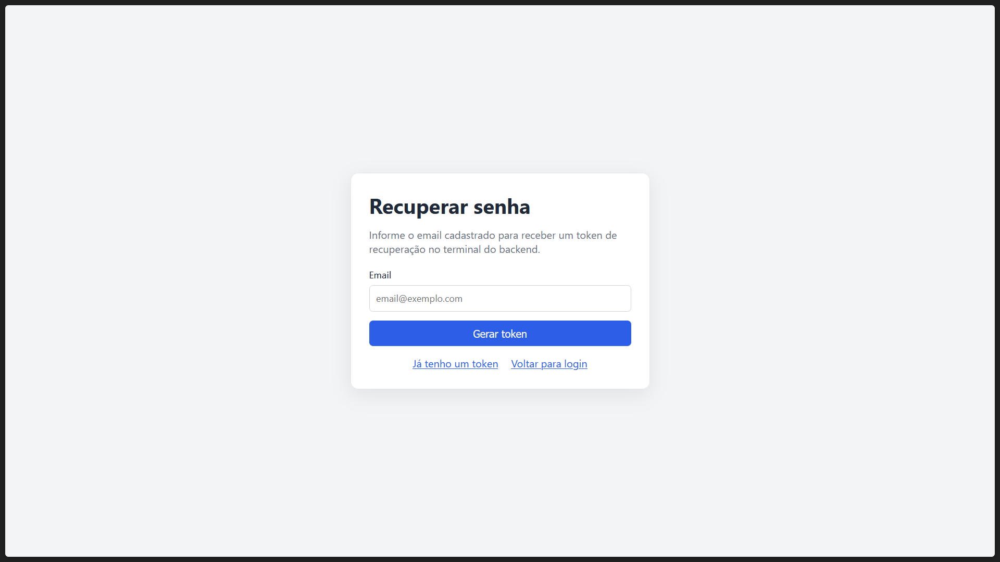
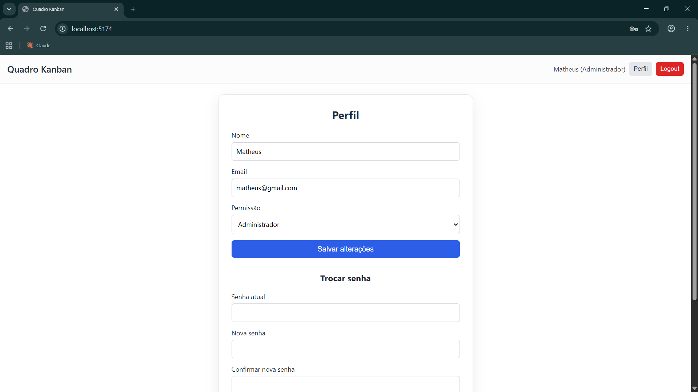
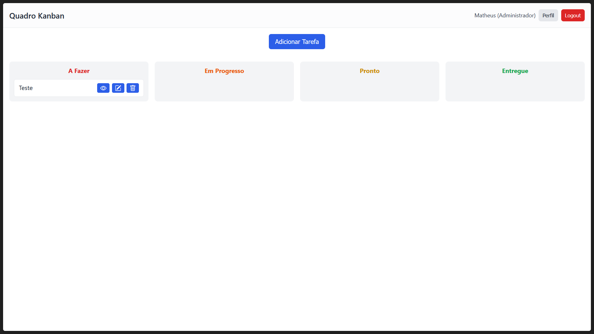
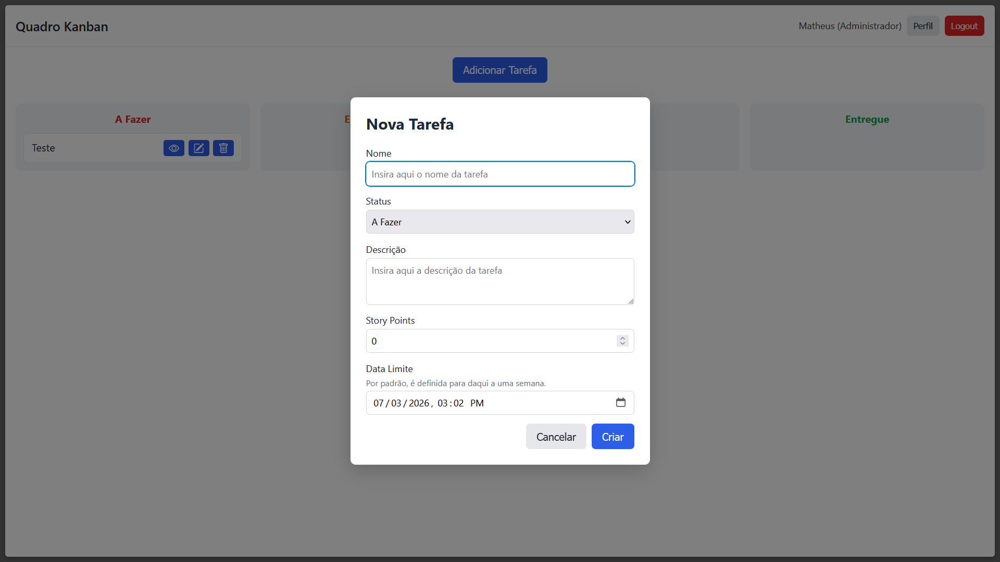
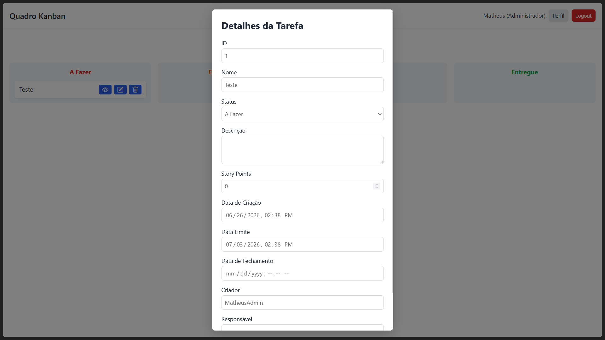

# [T2] Quadro Kanban - Programação para Web

---

### Contexto

Sistema de quadro Kanban para gestão de tarefas em equipe. 

A aplicação oferece cadastro e autenticação de usuários, recuperação de senha e o gerenciamento de tarefas distribuídas por status, com dois níveis de permissão: mantenedores administram todas as tarefas, enquanto usuários comuns atuam sobre aquelas pelas quais são responsáveis. 

A [primeira versão](https://github.com/mfigueireddo/t1-programacao-web) (T1), foi construída como uma aplicação Django, com todas as páginas renderizadas no servidor a partir de HTML e CSS e sem JavaScript — cada ação do usuário corresponde a um formulário e a um novo carregamento de página. 

Esta é a segunda versão (T2), onde o mesmo sistema foi reconstruído baseado numa API REST e um cliente em TypeScript que vivem em repositórios separados: [backend](https://github.com/mfigueireddo/t2-programacao-web-backend) e [frontend](https://github.com/mfigueireddo/t2-programacao-web-frontend).

---

## Como rodar o frontend localmente

### 1. Instalar dependências

```bash
npm install
```

### 2. Configurar URL da API

Crie ou edite o arquivo `.env` na raiz do frontend com:

```text
VITE_API_URL=http://127.0.0.1:8000
```

### 3. Rodar o frontend

```bash
npm run dev
```

O frontend ficará disponível em:

```text
http://localhost:5173/
```

---

## Como utilizar o website

Instruções sobre modelos e permissões estão disponíveis no README do backend.

Logo de início, o usuário precisa estar autenticado para visualizar o quadro Kanban. Caso não esteja, ele é redirecionado para o cadastro/login. Opcionalmente, também pode optar por recuperar sua senha.

Uma vez autenticado, o usuário é levado ao quadro Kanban, que exibe as tarefas cadastradas (caso existam).

Caso o usuário seja administrador, ele pode cadastrar uma nova tarefa.

As tarefas existentes são distribuídas em 4 colunas: **A fazer**, **Em Progresso**, **Pronto** e **Entregue**.

Junto aos cards das tarefas, ficam disponíveis botões para que o usuário possa:

- Visualizar mais dados da tarefa
- Editar dados da tarefa
- Deletar a tarefa (apenas administradores)

As tarefas são exibidas em um formulário que sobrepõe o quadro. O usuário pode sair dessa tela a qualquer momento clicando fora dela.

Existem alguns fluxos alternativos para realizar certas operações. Por exemplo: o usuário pode editar uma tarefa clicando inicialmente na visualização da tarefa e, em seguida, no botão "Editar".

Quando o usuário for administrador, ao editar uma tarefa ele verá listados todos os usuários cadastrados, podendo assim escolher o responsável.

Quando o usuário for "comum", ao editar uma tarefa ele pode atribuí-la a si mesmo, caso ela não tenha responsável. Se já for o responsável, pode editar o status da tarefa. Além disso, pode retirar sua atribuição da tarefa a qualquer momento.

Quando uma tarefa é marcada como **Entregue**, sua data de fechamento é atribuída automaticamente. Da mesma forma, se a tarefa deixa de estar **Entregue**, a data de fechamento é descartada.

O usuário pode, a qualquer momento, acessar 3 funcionalidades pela topbar:

1. Visualizar o quadro, clicando em "Quadro Kanban".
2. Observar e editar os detalhes da sua conta, clicando em "Perfil".
3. Realizar o "Logout".

Ao visualizar os detalhes de seu perfil, o usuário pode:

1. Trocar seu nome
2. Trocar seu email
3. Trocar sua permissão (caso seja administrador)
4. Trocar sua senha
5. Deletar sua conta

"Salvar alterações" leva o usuário de volta ao quadro Kanban.

"Trocar senha" faz o logout do usuário, exigindo que ele faça login novamente.

A deleção de conta e de tarefa exibem uma mensagem de confirmação ao usuário antes de confirmar a exclusão.

---

## O que funciona e o que não funciona

Dado o que foi proposto, tudo foi testado e funciona. A única limitação a se pontuar é que a recuperação de senha via e-mail é apenas exibida no terminal da aplicação, em vez de ser enviada por e-mail de fato.

---

## Arquivos `.ts` e suas responsabilidades

| Arquivo | Responsabilidade |
| --- | --- |
| `src/main.ts` | Ponto de entrada; orquestra a navegação, a barra superior e a composição de cada página. |
| `src/auth.ts` | Telas e handlers de autenticação (login, cadastro, recuperação e redefinição de senha). |
| `src/board.ts` | Quadro Kanban: HTML das colunas/cartões e ligação das ações de cada tarefa. |
| `src/profile.ts` | Tela de perfil: edição de dados e troca de senha. |
| `src/utils.ts` | Utilitários genéricos de DOM, formatação e erro, além da raiz `#app`. |
| `src/permissions.ts` | Regras de permissão por papel (criar, editar, deletar e responsável). |
| `src/formUtils.ts` | Helpers de modal/formulário (casco do modal, campos e datas). |
| `src/taskForm.ts` | Modal de criação de tarefa. |
| `src/taskView.ts` | Modal de visualização (somente leitura) de tarefa. |
| `src/taskEdit.ts` | Modal de edição de tarefa. |
| `src/taskDelete.ts` | Modal de confirmação de exclusão de tarefa. |
| `src/taskDetailForm.ts` | Formulário compartilhado de tarefa, usado na visualização e na edição. |
| `src/api/client.ts` | Cliente HTTP central (URL base, token e tratamento de erros). |
| `src/api/session.ts` | Sessão: token e usuário guardados no `localStorage`. |
| `src/api/tasks.ts` | Chamadas aos endpoints de tarefas (`/tasks/`). |
| `src/api/users.ts` | Chamadas de autenticação, perfil e usuários (`/auth/`, `/users/`). |
| `src/types/task.ts` | Tipos de tarefa e seus status. |
| `src/types/user.ts` | Tipos de usuário e payloads de autenticação/perfil. |
| `src/vite-env.d.ts` | Tipos de ambiente do Vite (gerado). |

---

## Algumas imagens da versão final do projeto













